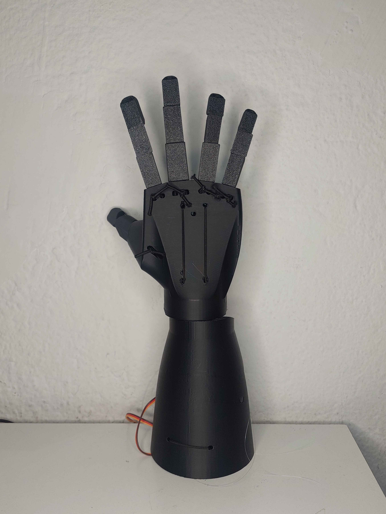
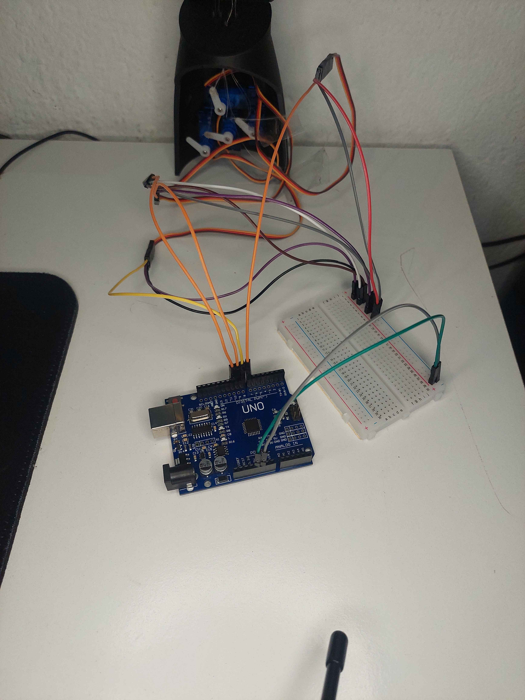
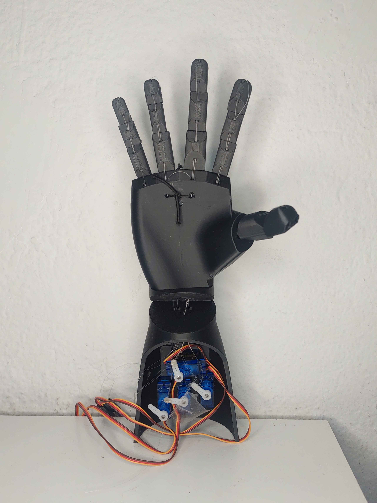
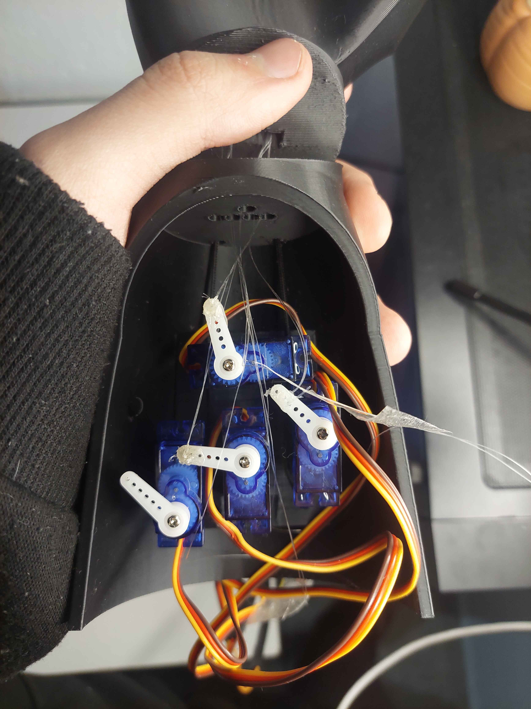
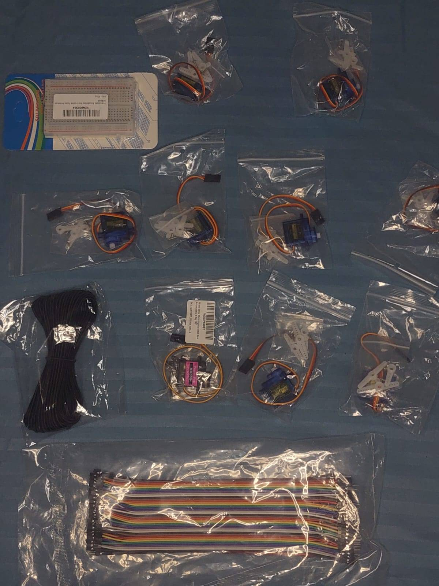
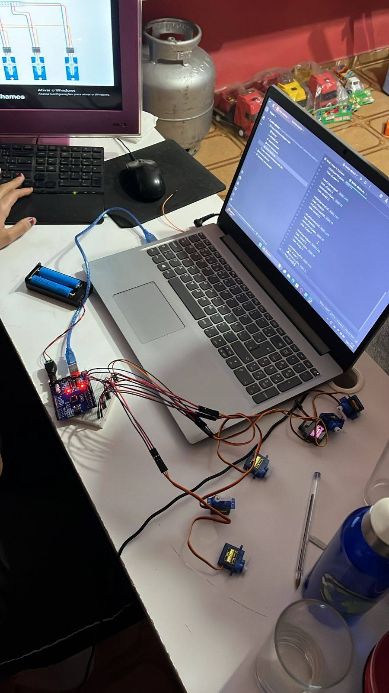

<div align="center">

# 🤖 Robotic Hand via Computer Vision

**Capstone Project (TCC) — Mechatronics Technical Degree · ETEC Horácio Augusto da Silveira · 2025**

A 3D-printed biomimetic robotic hand controlled in real time by computer vision.
Tracks human hand movements via webcam and reproduces them through 6 servo motors driven by Arduino.

[](https://www.python.org/)
[](https://opencv.org/)
[](https://mediapipe.dev/)
[](https://www.arduino.cc/)
[](https://www.autodesk.com/products/fusion-360/)

</div>

---

## 📸 The Project

<div align="center">
  
  
</div>

> **Left:** Front view of the assembled hand with all five fingers extended.
> **Right:** Back view showing the nylon tendon system used to transmit force from the servos to the fingers.

---

## 🎯 Overview

This project replicates the natural movement of a human hand using a **biomimetic approach** — emulating the anatomical structure of bones, tendons, and joints. A webcam tracks the user's hand in real time using MediaPipe, and the system translates finger positions into PWM signals that drive servo motors mounted at the wrist of the prosthesis.

The project sits at the intersection of:

- **Computer Vision** (OpenCV + MediaPipe Hands)
- **Embedded Systems** (Arduino + PySerial via PyFirmata)
- **Mechanical Design** (Fusion 360 + 3D printing)
- **Biomechanics & Biomimicry** (anatomical modeling of the human hand)

---

## 🏗️ Architecture

```
┌──────────────┐     ┌─────────────────────┐     ┌──────────────────┐
│   Webcam     │ ──▶ │ Python (OpenCV +    │ ──▶ │ Arduino UNO via  │
│  (640x480)   │     │ MediaPipe)          │     │ USB (PyFirmata)  │
└──────────────┘     │                     │     └────────┬─────────┘
                     │ • 21 hand landmarks │              │
                     │ • Distance calc     │              ▼ PWM signals
                     │ • Finger state      │     ┌──────────────────┐
                     │ • Wrist angle       │     │  6× Servo Motors │
                     └─────────────────────┘     │  (5 fingers + 1  │
                                                 │   wrist rotation)│
                                                 └────────┬─────────┘
                                                          │
                                                          ▼
                                                 ┌──────────────────┐
                                                 │  Nylon tendons → │
                                                 │  finger movement │
                                                 └──────────────────┘
```

### Pin mapping (Arduino UNO)

| Servo | Pin | Function |
|---|---|---|
| 1 | D10 | Polegar (Thumb) |
| 2 | D9  | Indicador (Index) |
| 3 | D8  | Médio (Middle) |
| 4 | D7  | Anelar (Ring) |
| 5 | D6  | Mínimo (Pinky) |
| 6 | D5  | Pulso (Wrist rotation) |

---

## ⚙️ Hardware

<div align="center">
  
  
</div>

> **Left:** Arduino UNO mounted with breadboard and jumper cables connecting to the servos inside the forearm.
> **Right:** The 6 servos (1× MG90S + 5× SG90) installed in the forearm housing, with nylon tendons running up to each finger.

### Components

| Component | Quantity | Notes |
|---|---|---|
| Arduino UNO | 1 | Central control unit |
| Servo MG90S | 1 | Higher-torque servo (used on the thumb) |
| Servo SG90 | 8 | 5 active + 3 spare for replacement |
| Breadboard | 1 | Power distribution |
| Jumper cables (M-F / M-M) | 40+ | Wiring |
| PLA filament (1 kg) | 1 | Hand body, fingers, joints |
| Nylon line | ~5 m | Artificial tendons |
| Tubular elastic | ~1 m | Return spring (resets fingers to open position) |
| Rechargeable batteries + case | 1 set | Mobile power supply |
| USB cable A-B | 1 | Programming + power |

### Materials list (raw)

<div align="center">
  
</div>

> Initial component set after delivery — servos, breadboards, jumper cables, PLA filament, and structural parts.

---

## 🧠 Software

### Computer Vision Pipeline

The Python script (`main.py`) does the following on every frame:

1. **Captures** a 640×480 frame from the webcam via OpenCV
2. **Detects** the hand using MediaPipe Hands (21 landmarks)
3. **Calculates distances** between specific landmark pairs:
   - Thumb → distance between landmarks 4 and 17 (horizontal)
   - Index → vertical distance between landmarks 5 and 8
   - Middle → vertical distance between landmarks 9 and 12
   - Ring → vertical distance between landmarks 13 and 16
   - Pinky → vertical distance between landmarks 17 and 20
4. **Determines finger state** (open/closed) by comparing each distance to a threshold
5. **Computes wrist rotation** via `atan2` between landmark 0 (wrist) and landmark 9 (middle base)
6. **Sends commands** to the Arduino via `pyfirmata` (USB serial)

### Custom angle mapping

Each servo has a different angle range due to mechanical mounting. The function `abrir_fechar(pin, on_off)` handles this:

| Pin | Closed angle | Reason |
|---|---|---|
| 10 (Thumb) | 150° | Mechanical positioning of the thumb's base servo |
| 9 (Index)  | 180° | Tendon path requires wider rotation arc |
| 8, 7, 6 (others) | 140° | Standard for the remaining fingers |

---

## 📂 Repository structure

```
robotic-hand-computer-vision/
├── code/
│   ├── main.py                 # Main script — vision + Arduino control
│   ├── servo_braco3d.py        # Module — servo abstraction layer
│   └── requirements.txt        # Python dependencies
├── images/
│   ├── 01_hand_open_front.jpg
│   ├── 02_hand_back_tendons.jpg
│   ├── 03_arduino_setup.jpg
│   ├── 04_servos_inside.jpg
│   ├── 05_components_kit.jpg
│   └── 06_team_workbench.jpg
├── docs/
│   └── biomimetics.md          # Theoretical background (biomimicry + biomechanics)
└── README.md                   # This file
```

---

## 🚀 How to run

### 1. Hardware setup

Connect the 6 servos to the Arduino UNO following the pin mapping above. Power the servos through a breadboard with a stable 5V supply (USB or external batteries).

### 2. Install Firmata on the Arduino

Open the Arduino IDE → `File → Examples → Firmata → StandardFirmata` → Upload to your board.

### 3. Install Python dependencies

```bash
cd code
pip install -r requirements.txt
```

### 4. Adjust the COM port

In `servo_braco3d.py`, change `'COM9'` to match your Arduino's port:
- **Windows:** `COM3`, `COM4`, etc. (check Device Manager)
- **Linux/macOS:** `/dev/ttyUSB0` or `/dev/cu.usbmodem*`

### 5. Run

```bash
python main.py
```

Press `ESC` to exit.

---

## 💰 Project budget

Total investment: **~R$ 744,00** — split among 5 team members (≈R$ 150/person).

| Item | Cost (BRL) |
|---|---|
| 3D printing service (Renova 3D) | 235.00 |
| 1× MG90S + 8× SG90 servos | 130.00 |
| PLA filament (1 kg) | 120.00 |
| Arduino UNO | 60.00 |
| Battery pack + charger | 50.00 |
| Wires, breadboard, glue, elastics | ~149.00 |

> Initial planned budget was R$ 600 — actual cost was higher due to needing 3 extra servos after mechanical adjustments.

---

## 🧬 Theoretical foundation

The project is grounded in two interdisciplinary fields:

- **Biomimicry** — designing systems inspired by biological structures (the human hand's bone-tendon-muscle system).
- **Biomechanics** — applying mechanical principles to study and replicate human movement.

The hand itself is one of the most complex anatomical structures in the human body, capable of fine motor control, adaptive grip, and force modulation. Replicating even a subset of these capabilities requires careful integration of mechanical design, electronics, and software.

📖 Read more in [`docs/biomimetics.md`](./docs/biomimetics.md).

### Compliance

The project also references **NR-17 (Ergonomia)** — the Brazilian regulatory standard on ergonomics — as a design consideration for prosthetic and assistive devices.

---

## 🧩 Development process

The project followed 4 main phases over the 2025 academic year:

1. **3D Modeling** — Detailed modeling in Autodesk Fusion 360 with 3D-printable parts in PLA. Base model adapted from open repositories ([Cults3D](https://cults3d.com/) and [TurboSquid](https://www.turbosquid.com/)).
2. **Articulation system** — Joints designed with chamfers and aligned holes. Nylon line acts as artificial tendons; tubular elastic provides passive return to the open position.
3. **Electronic integration** — Initial validation in TinkerCad, then physical assembly with Arduino UNO + 6 servos + breadboard. PWM signals control individual finger angles.
4. **Computer vision integration** — Python pipeline using OpenCV + MediaPipe to detect hand landmarks and translate them into servo commands.

<div align="center">
  
</div>

> Workbench during one of the integration sessions — Arduino, breadboard, and servos under test.

---

## 🔗 Connection to subsequent work

The MediaPipe-based hand-tracking approach developed for this project later evolved into **[VisuAll](https://github.com/Juanduarte050508/VisuAll)** — a real-time recognition system for the Brazilian Sign Language (Libras) alphabet. The same principle of extracting normalized hand landmarks was extended into a full ML pipeline with two MLP classifiers.

---

## 👥 Team

Developed by a 5-person team during the final year of the Mechatronics Technical Degree at **ETEC Horácio Augusto da Silveira (2025)**.

**My role:** computer vision integration (Python + OpenCV + MediaPipe), Arduino programming, and 3D modeling support.

---

## 📜 References

- Cults3D — base 3D model: https://cults3d.com/:1368317
- TurboSquid hand model reference: https://www.turbosquid.com/3d-models/hand-model-1378075
- MediaPipe Hands documentation: https://google.github.io/mediapipe/solutions/hands
- NR-17 — Ergonomia (Norma Regulamentadora Brasileira)

---

<div align="center">
<sub>Part of the <a href="../">Engineering Portfolio</a> by Juan Duarte Moura</sub>
</div>
